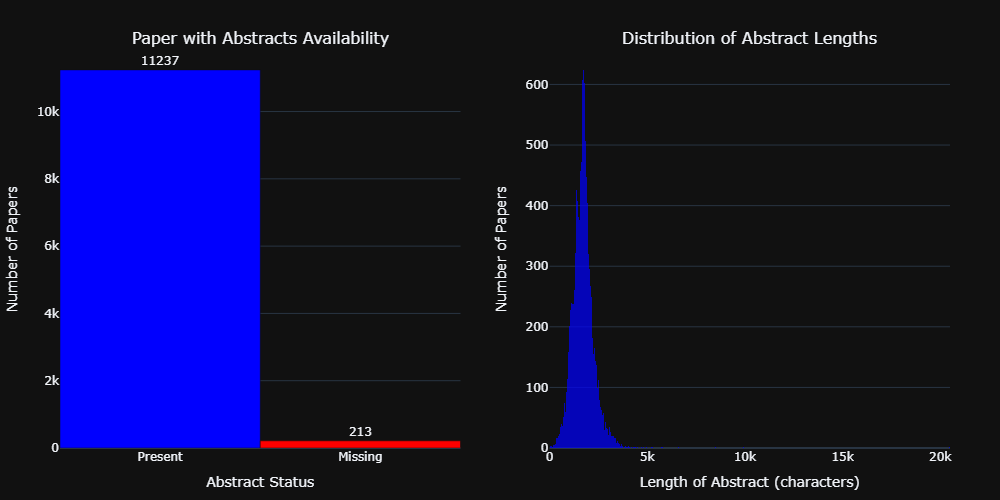
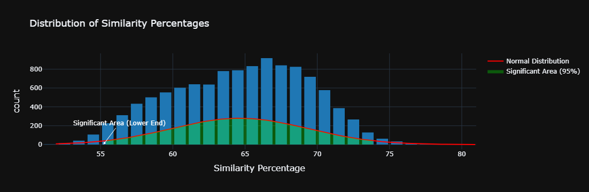
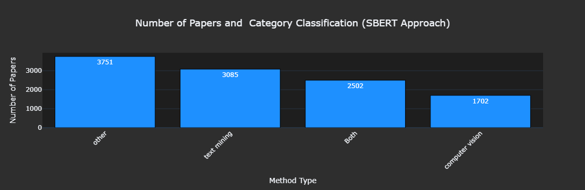
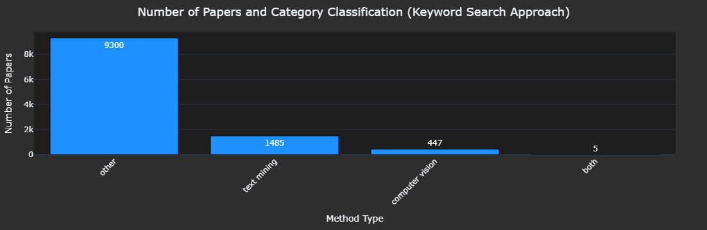

# Semantic NLP Filtering for Deep Learning Papers in Virology/Epidemiology

## Project Overview

This project aim to address  filtering research papers on **virology and epidemiology** that utilise **deep learning neural network based solution**, from a large dataset retrieved through keyword-based searches. The problem with traditional keyword-based filtering is that it often returns irrelevant papers that mention but do not substantively apply these techniques. To overcome this, the project uses **Semantic Natural Language Processing (NLP)** techniques, specifically the **Sentence-BERT (SBERT) Transformer model**, to semantically filter and rank papers based on their relevance to deep learning applications in these fields. SBERT generates embeddings to measure the similarity of abstracts, allowing for more accurate identification of relevant papers.


### Key Features:
- **Semantic Filtering**: Leverages NLP techniques to filter out irrelevant papers that do not utilise deep learning approaches.
- **Classification**: Relevant papers are classified into categories based on their method: `["text mining", "computer vision", "both", "other"]`.
- **Method Extraction**: Automatically extracts and reports the specific deep learning method used in each relevant paper.

---

## Data Source:

### Data Collection Procedure:

The dataset for this study was sourced from the publicly accessible **Virology AI Papers Repository**, which compiles research articles at the intersection of virology, epidemiology, and artificial intelligence applications. The repository contains metadata of **11,450 academic papers** from PubMed, focusing on deep learning and neural networks in virology and epidemiology. The dataset includes fields such as PubMed ID (PMID), paper title, authors, citations, journal/book, publication year, DOI, and abstracts (optional). It provides accessible metadata for research and links to PubMed Central for full-text access when available.

**Data Source Repository**: [Virology AI Papers Repository](https://github.com/jd-coderepos/virology-ai-papers/)

**Data Source**: [PubMed](https://pubmed.ncbi.nlm.nih.gov/)

**Total records**: 12,980 (with duplicates)


## Table of Contents
1. [Project Structure](#project-structure)
2. [Installation](#installation)
3. [Literature Review](#literature-review)
4. [Methodology](#methodology)
5. [Results and Statistics](#results-and-statistics)
6. [Contributing](#contributing)
7. [Contact Information](#contact-information)

---

## Project Structure

```bash
├── data/                  # Contains the dataset (CSV format)
├── myenv                  # virtual environment and installed librabries
├── results                # Output of filtered papers (CSV format) 
   ├── Images/             # classification results with graphs and plots (Images)
├── Semantic_NLP_Filtering_for_Deep_Learning_Papers_in_Virology_Epidemiology.ipynb              # Jupyter notebook for implemntation
├── requirements.txt       # Python dependencies
└── README.md              # Project documentation (this file)
```

---

## Installation

### Prerequisites:
- **Python 3.x**
- **Git**
- Python libraries specified in `requirements.txt`

### Steps:

1. Clone the repository:

   ```bash
   git clone https://gitlab.com/dsohith/Semantic-NLP-Filtering-for-Deep-Learning-Papers-in-Virology_Epidemiology.git
   ```

2. Install the required dependencies:

   ```bash
   pip install -r requirements.txt
   ```

---

## Project Notebook

```bash
Semantic_NLP_Filtering_for_Deep_Learning_Papers_in_Virology_Epidemiology.ipynb
```


## Literature Review

### Keywords-Based Filtering : 

Keywords-based searches are widely used for initial paper retrieval but often result in irrelevant records due to their inability to grasp context and semantics. For example, a paper might mention deep learning but may not focus on it as the primary method. This is a limitation that has been noted in several studies (Huang et al., 2015; Jones et al., 2017).

## Semantic Filtering with NLP : 

Recent advances in NLP, especially with transformer-based models like BERT, have improved the semantic understanding of text. Sentence-BERT  extends BERT by generating sentence embeddings, making it effective for semantic similarity tasks, such as document filtering (Reimers & Gurevych, 2019). Other approaches, like TF-IDF or Latent Semantic Analysis (LSA), are limited in capturing deep contextual meanings and dependencies between words, making SBERT a superior choice for this task (Blei et al., 2003).

## Other Approaches Considered:

Latent Dirichlet Allocation (LDA), while useful for topic modeling, is more coarse-grained and cannot semantically rank individual abstracts as precisely as SBERT (Blei et al., 2003). TF-IDF is useful for keyword matching but does not account for context and meaning, which is crucial in understanding complex research papers (Ramos, 2003). Word2Vec and Doc2Vec, although they capture word semantics, do not perform as well as SBERT in sentence-level understanding, which is essential for filtering academic abstracts (Mikolov et al., 2013; Le & Mikolov, 2014). The choice of SBERT over other methods stems from its ability to provide more accurate semantic embeddings, leading to better filtering performance (Reimers & Gurevych, 2019).


## Methodology

## Sentence-BERT (SBERT):

The project uses Sentence-BERT (SBERT) to generate sentence embeddings for each abstract. SBERT builds on BERT’s transformer architecture to encode abstracts into a semantic vector space. By comparing the embeddings of each paper’s abstract with predefined query embeddings (representing relevant deep learning applications in virology/epidemiology), it can determine the most contextually relevant papers.

## Why SBERT is more effective than keyword-based filtering ? 

SBERT captures semantic meaning beyond simple keyword matches. This allows it to filter out irrelevant papers that mention keywords like "deep learning" or "neural networks" without actually focusing on these topics. By encoding sentences as vectors, SBERT ensures that papers with relevant content are retrieved based on contextual similarity, not just word occurrences.


## Task 1:  Semantic natural language processing techniques to filter out papers that do not meet the criteria of utilizing deep learning approaches in virology/epidemiology.

A structured approach was employed to filter research papers using deep learning techniques in the fields of virology or epidemiology. To streamline the identification of relevant studies, a semantic filtering method was implemented, leveraging the SentenceTransformer model (all-MiniLM-L6-v2), which efficiently generates high-quality embeddings of paper abstracts. This model captures the semantic meaning of each abstract by converting it into a vector in a high-dimensional space, offering a more context-aware representation than traditional keyword-based searches.

Next, deep learning-related keywords were embedded using the same model, allowing for the accurate semantic comparison between abstracts and keywords. This step was crucial in identifying papers that discussed deep learning methodologies in a meaningful context, even if specific keywords were not directly used in the text.

The filtering process hinged on calculating cosine similarity between the abstract and keyword embeddings. Cosine similarity measures the angle between two vectors, producing a score between -1 and 1, where higher values indicate greater similarity. To ensure only relevant papers were included, a statistical thresholding method was applied. The mean and standard deviation of the cosine similarity scores across all abstracts were computed, and papers with a the percentage similarity between abstract and keywords—above the threshold of mean - 2 standard deviations were retained.

This semantic approach enabled the identification of papers strongly aligned with deep learning methodologies in virology or epidemiology, avoiding the limitations of exact keyword matching. As a result, the process significantly reduced the manual effort involved in filtering irrelevant articles, ensuring the inclusion of papers with meaningful connections to the research focus.


 ## Task 2: For the papers deemed relevant, classify them according to the type of method used: ["text mining", "computer vision", "both", "other"].

Following the identification of relevant papers, the next task was to classify them into one of four categories based on the methods employed: "text mining," "computer vision," "both," or "other." The classification process was driven by a semantic comparison between the content of each paper's abstract and predefined embeddings that represented the methods of text mining and computer vision. These method embeddings were generated by encoding  keywords associated with each technique using the same SentenceTransformer model used in the earlier filtering stage. This ensured that the classification was based on the semantic meaning of the text, rather than an exact match of specific terms.

For each abstract, the cosine similarity was calculated between its embedding and the embeddings for text mining and computer vision. The resulting similarity scores indicated how closely the paper's abstract aligned with each method. A higher similarity score suggested a stronger connection between the abstract and the respective method. If the similarity scores for both text mining and computer vision surpassed a predefined threshold, the paper was classified as "both." If only one method had a high similarity score, the paper was assigned to either the "text mining" or "computer vision" category accordingly. Papers that did not demonstrate a strong similarity to either method were placed in the "other" category.

This classification methodology offered a nuanced and semantically grounded approach, enabling the identification of papers that utilized multiple methods or those that employed less common terminology related to the methods. The reliance on semantic content ensured that papers were accurately classified, even in cases where the terminology used in the abstract differed from the typical keywords associated with the methods.

## Task 3: Extract and report the name of the method used for each relevant paper.

The third task involved extracting and identifying the specific deep learning method used in each relevant paper. The goal was to pinpoint the exact technique from a predefined set of methods, including architectures such as CNN, RNN, Transformer, and other deep learning frameworks. The extraction process closely mirrored the earlier classification task, but here the focus was on identifying the most relevant deep learning method based on the semantic content of the abstract. As before, embeddings for each deep learning method were generated using keywords that represent each technique, leveraging the SentenceTransformer model.

For each paper, the cosine similarity between the abstract's embedding and the embeddings of all predefined deep learning methods was calculated. The resulting similarity scores provided an indication of how well each method aligned with the content of the abstract. The method with the highest similarity score was considered the most likely deep learning technique used in the paper. When there was a significant difference in similarity scores between methods, the paper was confidently assigned to the method with the highest score. This approach enabled the precise identification of the deep learning technique used, even if the method was not explicitly mentioned in the paper.

The advantage of this process lay in its ability to capture the semantic meaning of the abstract, ensuring that even when a method was not directly named or was described using less common terms, the correct technique could still be extracted. By moving beyond strict keyword matching and instead using semantic embeddings, this method provided a more robust and accurate means of identifying the deep learning techniques employed. This approach was particularly beneficial for handling the complex and varied language often found in research papers, allowing for accurate identification of methods even when described in different or indirect terms.


## Results and Statistics

### Dataset Overview:
- **Initial dataset size**: 11,450 papers

| Column            | Non-Null Count  | Data Type |
|-------------------|-----------------|-----------|
| PMID              | 11,450          | int64     |
| Title             | 11,450          | object    |
| Authors           | 11,450          | object    |
| Citation          | 11,450          | object    |
| First Author      | 11,450          | object    |
| Journal/Book      | 11,450          | object    |
| Publication Year  | 11,450          | int64     |
| Create Date       | 11,450          | object    |
| PMCID             | 6,450           | object    |
| NIHMS ID          | 956             | object    |
| DOI               | 10,969          | object    |
| Abstract          | 11,237          | object    |


- **Distribution of Abstract Length**

| Statistic | Value       |
|-----------|-------------|
| Count     | 11,237      |
| Mean      | 1,723.08    |
| Standard Deviation (std) | 575.94    |
| Minimum   | 4           |
| 25%       | 1,386       |
| Median (50%) | 1,699     |
| 75%       | 1,983       |
| Maximum   | 20,492      |


### Data Pre processing:

- Initial size: 11450 
- Missing abstracts: 213
- Filtered size: 11237
- Converts text to lowercase
- Remove special characters
- Lemmatize words to base form
- Remove stopwords



### Results:

### Task 1: Filtering papers that do not meet the criteria of utilizing deep learning approaches

**Filtering using SBERT model**

- **Distribution of similarity percentage**



 Total papers with Abstract: 11237 <br>
 Total relevant papers similarity with deep learning keywords: 11040

-  **Comparision with key word based search**

| Keyword Match Count | Count |
|---------------------|-------|
| 0                   | 4313  |
| 1                   | 3736  |
| 2                   | 1884  |
| 3                   | 933   |
| 4                   | 260   |
| 5                   | 66    |
| 6                   | 31    |
| 7                   | 10    |
| 8                   | 4     |
  

The comparison between the SBERT-based similarity approach and the keyword-based search for identifying relevant papers reveals key differences in effectiveness. The SBERT-based method identified 11,040 papers as relevant, demonstrating its ability to capture papers discussing deep learning in a broader, more nuanced context, even if the exact deep learning keywords were not present. This approach leverages semantic embeddings to compare the meaning of the abstracts to predefined deep learning-related keywords, ensuring a more comprehensive identification process. In contrast, the keyword-based search identified papers based solely on the presence of specific deep learning keywords. The results show a steep drop-off in the number of papers as the number of matching keywords decreases, with 4,313 papers having no keyword matches at all. This suggests that keyword-based methods tend to overlook papers that may discuss deep learning using different terms or indirect references. Thus, while the keyword-based search offers a simpler and more direct method, it is limited in its scope, whereas the SBERT-based similarity approach provides a more inclusive and context-aware classification, highlighting its superior performance in filtering relevant papers related to deep learning in virology and epidemiology.

### Task 2 : Classification into ["text mining", "computer vision", "both", "other"].

- **Classification based on SBERT model**

| Method Type      | Count |
|------------------|-------|
| other            | 3751  |
| text mining      | 3085  |
| Both             | 2502  |
| computer vision  | 1702  |



- **Classification based on Keyword based search**

| Category         | Count |
|------------------|-------|
| other            | 9300  |
| text mining      | 1485  |
| computer vision  | 447   |
| both             | 5     |




The comparison between the SBERT-based classification and the keyword-based search classification reveals notable differences in how each method categorizes research papers. The SBERT model identifies a more diverse range of approaches, with a significant number of papers (3,751) categorized as "Other," reflecting its ability to capture a wide variety of methods beyond predefined categories such as text mining and computer vision. This is followed by a substantial number of papers classified under text mining (3,085), both text mining and computer vision (2,502), and computer vision (1,702), highlighting the model's capacity to identify multimodal approaches and capture semantic nuances. In contrast, the keyword-based search produces a larger proportion of papers classified as Other (9,300), indicating that the method's reliance on specific keywords leads to a loss of papers discussing relevant methodologies using alternative terminology. It also identifies fewer papers under text mining (1,485) and computer vision (447), suggesting that the search fails to account for variations in terminology or the broader scope of deep learning methods. Furthermore, the small number of papers classified as using both methods (only 5) emphasizes the limitations of keyword-based searches in recognizing multimodal approaches. Overall, the SBERT model provides a more comprehensive and semantically aware classification, while the keyword-based approach tends to miss relevant papers due to its reliance on exact keyword matches.


### Task 3: Method used for each relevant paper.


- **Count of papers belongs to specific methods.**

| Method Used                         | Count |
|-------------------------------------|-------|
| text analytics                      | 1,195 |
| feedforward neural network           | 960   |
| multimodal neural network            | 935   |
| pretrained language model            | 756   |
| natural language processing          | 747   |
| RNN                                  | 713   |
| text mining                          | 650   |
| vision model                         | 624   |
| LSTM                                 | 498   |
| image processing                     | 448   |
| vision transformer                   | 311   |
| CNN                                  | 305   |
| sequence-to-sequence models          | 273   |
| neural net algorithm                 | 266   |
| long short-term memory network       | 233   |
| convolutional neural network         | 200   |
| textual data analysis                | 184   |
| recurrent neural network             | 183   |
| generative deep learning             | 160   |
| vision algorithms                    | 130   |
| computer graphics and vision         | 128   |
| computer vision                      | 122   |
| language modeling                    | 101   |
| generative AI                        | 100   |
| multimodal model                     | 100   |
| foundation model                     | 87    |
| NLP                                  | 78    |
| object recognition                   | 61    |
| generative artificial intelligence   | 57    |
| continuous diffusion model           | 46    |
| speech and language technology       | 45    |
| transformer models                   | 43    |
| language processing                  | 42    |
| diffusion-based generative model     | 34    |
| computational semantics              | 33    |
| generative models                    | 29    |
| self-attention models                | 26    |
| large language model                 | 24    |
| attention-based neural networks      | 19    |
| diffusion model                      | 18    |
| transformer                          | 13    |
| LLM                                  | 13    |
| transformer networks                 | 11    |
| transformer-based model              | 10    |
| generative diffusion model           |  7    |
| generative language model            |  6    |
| transformer architecture             |  6    |
| multilayer perceptron                |  5    |
| GRNN                                 |  3    |
| computational linguistics            |  2    |
            

**Top 10 methods used in papers belongs to Virology/Epidemiology**


.

---


## Conclusion

This project successfully streamlined the early stages of article collection for review by employing Semantic NLP filtering with the Sentence-BERT (SBERT) model, effectively minimizing the need for manual scanning and filtering of numerous articles. The SBERT-based approach significantly outperformed traditional keyword-based searches by capturing semantic meaning and context, leading to more accurate identification and categorization of papers focused on deep learning applications in virology and epidemiology. The project not only filtered relevant papers but also classified them into key methodological categories such as text mining, computer vision, and both, while accurately extracting the specific deep learning techniques used. This approach provides an efficient and powerful tool for researchers to navigate large datasets with precision and reduced manual effort.

---


## Contact Information

For any questions or suggestions regarding the project, please contact:
- **Project Lead**: Sohith Dhavaleswarapu
- **Email**: sohith.dhavaleswarapu@gmail.com
- **GitLab Profile**: https://github.com/dsohith

---

## Bibliography

### Keyword-based Filtering:

- Wang, J.; Su, G.; Wan, C.; Huang, X.; Sun, L. A Keyword-Based Literature Review Data Generating Algorithm—Analyzing a Field from Scientific Publications. Symmetry 2020, 12, 903. https://doi.org/10.3390/sym12060903
- Sanderson, Mark & Croft, W.. (2012). The History of Information Retrieval Research. Proceedings of The IEEE - PIEEE. 100. 1444-1451. 10.1109/JPROC.2012.2189916. 

### Semantic Filtering with NLP:

- Reimers, N., & Gurevych, I. (2019). Sentence-BERT: Sentence embeddings using Siamese BERT-networks. Proceedings of the 2019 Conference on Empirical Methods in Natural Language Processing. Association for Computational Linguistics. https://arxiv.org/abs/1908.10084
- Devlin, J., Chang, M. W., Lee, K., & Toutanova, K. (2019). BERT: Pre-training of deep bidirectional transformers for language understanding. *NAACL-HLT 2019*. [https://arxiv.org/abs/1810.04805](https://arxiv.org/abs/1810.04805)

### Latent Dirichlet Allocation (LDA):

- Blei, David & Ng, Andrew & Jordan, Michael. (2001). Latent Dirichlet Allocation. The Journal of Machine Learning Research. 3. 601-608. 

### TF-IDF & Cosine Similarity:

- Ramos, J. (2003). Using TF-IDF to determine word relevance in document queries. In *Proceedings of the First International Conference on Machine Learning*.

### Word2Vec & Doc2Vec:

- Mikolov, T., Chen, K., Corrado, G., & Dean, J. (2013). Efficient estimation of word representations in vector space. In *Proceedings of the International Conference on Learning Representations (ICLR)*. [https://arxiv.org/abs/1301.3781](https://arxiv.org/abs/1301.3781)
- Le, Q., & Mikolov, T. (2014). Distributed representations of sentences and documents. In *Proceedings of the 31st International Conference on Machine Learning (ICML)*.

### Transformer Models and Sentence-BERT:

- Vaswani, A., Shazeer, N., Parmar, N., Uszkoreit, J., Jones, L., Gomez, A. N., & Polosukhin, I. (2017). Attention is all you need. *Advances in Neural Information Processing Systems, 30*, 5998-6008. [https://arxiv.org/abs/1706.03762](https://arxiv.org/abs/1706.03762)
